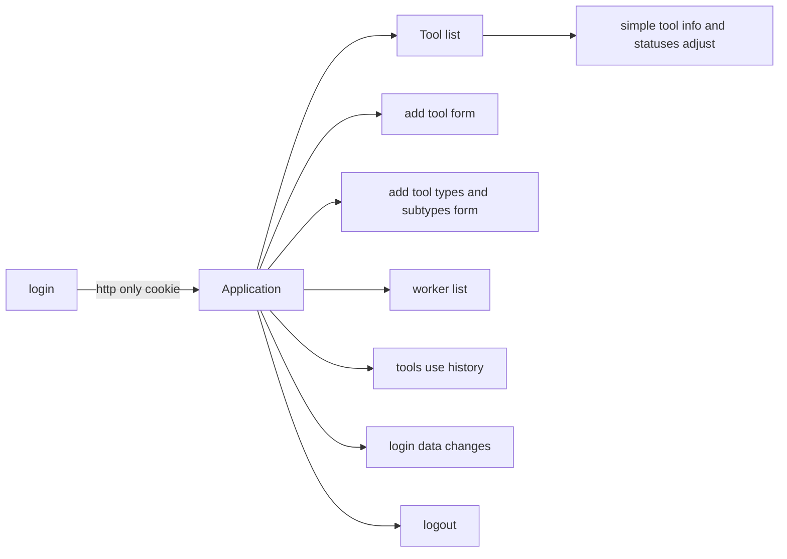

# Tool base application
## Front-end part
This application is integral part of tool base service. Back-end part you can find here:
https://github.com/darone90/toolbase-back
Application was made for client company Forman to have control on workshop tool. Forman can add new tools, remove old, add statuses, store places, responsible workers and adjust types and subtypes of equipment. Also he have access to history of each tool users.

## Application map
All application is available only after login:

## Technology stack
This app was made on React and written in TypeScript, contains global storage build with Redux tool kit. All css layer build with scss preprocessor. Routing was made with react-router.

## How to start ?
After repository clone, use node package manager to install required modules. In app folder tap in your terminal:
- npm install
After packages installing you can start developer server by command:
- npm start
To build static production version:
-npm run build
## Contact
To reach author use email address: pileckidariusz90@gmail.com
## Copyrights
All code and images in this app belong to Techglass Sp. z o.o. company
Using any parts of this repository in commercial are forbidden.
